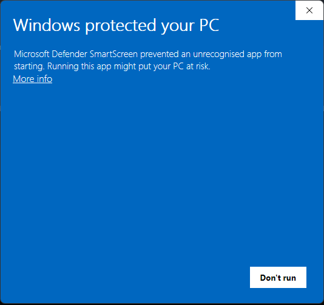
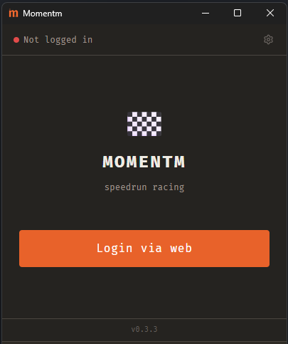
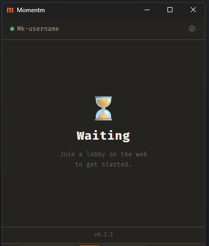
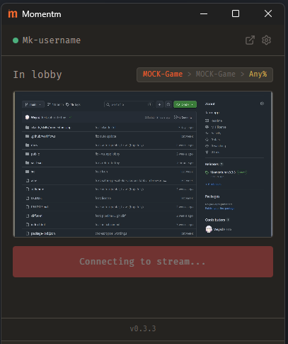
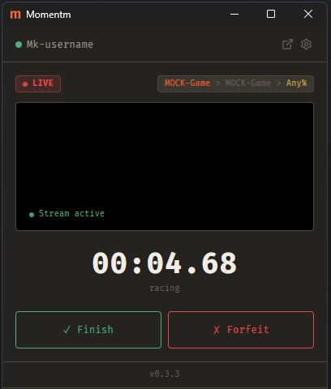
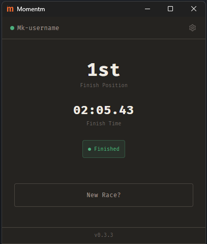

<div align="center">

# Speedrace

**The racer-side desktop client for the Speedrace speedrun race platform.**

Log in, join a race lobby from the web, go live with your screen, and race the clock head-to-head.

[](https://github.com/Weyrd/speedrace-app/releases/latest)


</div>

---

## What is it?

Speedrace is a speedrun **racing** platform. This app is the client a runner installs on their
own machine. It pairs with the [web companion](https://github.com/Weyrd) (where you browse and
join lobbies) and the realtime back-end that orchestrates each race.

Once you're in a lobby, the app:

- holds a **persistent connection** to the server and reacts to race events in realtime,
- **captures and streams your screen** to the race (WebRTC / WHIP your video never touches the API server, it goes straight to a media relay),
- runs the **race timer** locally and lets you **Finish** or **Forfeit**,
- shows your **final position and time** when the race ends.

The whole app is a single small window that walks through one screen per race phase
(see [How it works](#how-it-works) below).

---

## Download & install

Grab the latest build for your OS from the **[Releases page](https://github.com/Weyrd/speedrace-app/releases/latest)**.

The app **auto-updates** itself once installed, so you only need to download it once.

> ### ⚠️ "Windows protected your PC" (SmartScreen)
>
> The Windows installer is **not code-signed** (signing certificates are expensive), so Windows
> SmartScreen will warn you the first time you run it:
>
> 
>
> click **More info -> Run anyway**.
>
> If you'd rather not trust a pre-built binary, you can **clone the repo and compile it yourself**  
> see [Build & run from source](#build--run-from-source) below.

---

<details>
<summary><b>🛠️ Build &amp; run from source</b> (click to expand)</summary>

### Prerequisites

- **[Node.js](https://nodejs.org/)** (18+) and a package manager (`pnpm` recommended, `npm` works)
- **[Rust](https://rustup.rs/)** (stable toolchain)
- The Tauri 2 platform dependencies for your OS see the
  [Tauri prerequisites guide](https://v2.tauri.app/start/prerequisites/).

### Run in development

```bash
git clone https://github.com/Weyrd/speedrace-app.git
cd speedrace-app

pnpm install
pnpm tauri dev
```

Other useful scripts:

```bash
pnpm dev      # frontend only (Vite, http://localhost:1420)
pnpm build    # type-check + bundle the frontend (tsc && vite build)
```

### Build a production bundle

```bash
pnpm tauri build  # produces installers/bundles in src-tauri/target/release/bundle/
```

On **macOS** you can build and launch an unsigned debug bundle directly:

```bash
cargo tauri build --debug --bundles app
open src-tauri/target/debug/bundle/macos/Speedrace.app
```

> The Rust side lives in `src-tauri/` run `cargo build` / `cargo clippy` / `cargo check` from there.

</details>

---

## How it works

The app is a small state machine: each race phase has its own screen.

### 1. Log in

Launch the app and sign in. **Login via web** opens your browser, you authenticate there, and
you're redirected straight back into the app. You need to create an account on the main website first.



### 2. Wait for a lobby

Once logged in you land in the lobby. Head to the **web version** to join a race  
the app picks it up automatically.



### 3. Set up your stream

When you join a lobby, pick the window or screen you want to broadcast and the app connects
your stream to the race.



### 4. Race

When the race starts you go **LIVE**: your stream is active, the timer runs, and you race.
Hit **Finish** the moment you're done or **Forfeit** to drop out.



### 5. Results

When you finish, the app shows your **position** and **final time**. Hit **New Race?** to jump
back to the lobby and go again.



---

## Tech stack

| Layer       | Stack                                                              |
| ----------- | ------------------------------------------------------------------ |
| Shell       | **Tauri 2** (single 400×500 window)                                |
| Frontend    | **React 18** + Vite + Tailwind v4 `useReducer` phase state machine |
| Native side | **Rust** (`src-tauri/`) OAuth, persistent WebSocket, HTTP, state   |
| Streaming   | WebRTC **WHIP**                                                    |
| Auto-update | `tauri-plugin-updater` (GitHub Releases)                           |

---

<details>
<summary><b>🚀 Releasing (maintainers)</b></summary>

Releases are driven entirely by git tags **never edit the version files by hand.**
Pushing a version tag triggers CI, which extracts the version from the tag, updates
`tauri.conf.json` / `package.json` / `Cargo.toml`, builds for Windows + Linux + macOS
(Intel + ARM) in parallel, and creates a **draft GitHub Release** to validate manually.

```bash
git tag v0.3.8
git push origin v0.3.8
```

| Tag                 | Résultat       |
| ------------------- | -------------- |
| `v0.3.8`            | release stable |
| `v0.3.8-beta.1`     | pre-release    |
| `git push` sans tag | rien           |

### git-cliff (pas encore implémenté)

Generate automatically git diff
[Conventional Commits](https://www.conventionalcommits.org/) (`feat:`, `fix:`, `chore:`...).
for each release it creating a Cahngelog.md automatically

### Recommended IDE setup

- [VS Code](https://code.visualstudio.com/) + [Tauri](https://marketplace.visualstudio.com/items?itemName=tauri-apps.tauri-vscode) + [rust-analyzer](https://marketplace.visualstudio.com/items?itemName=rust-lang.rust-analyzer)

</details>
